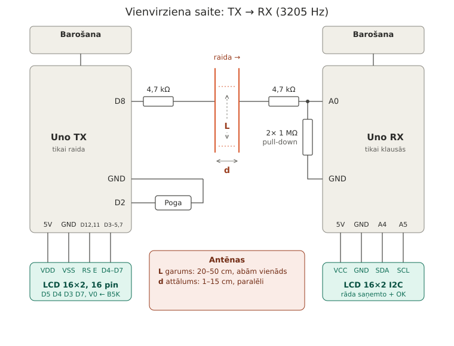
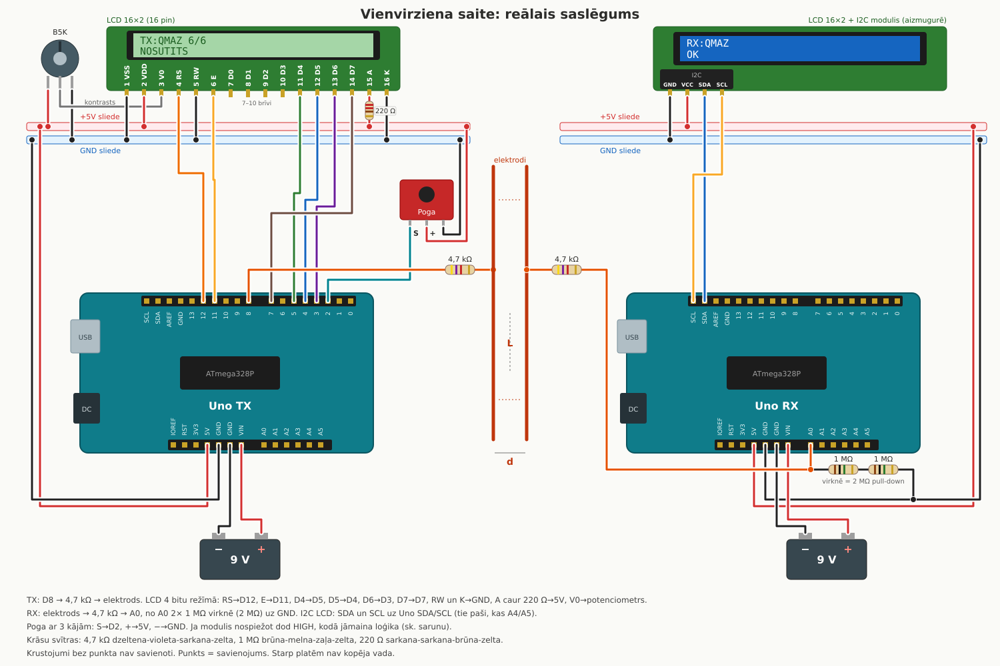

## Bezvadu komunikācija starp diviem Arduino

Datus nes elektriskais lauks starp divām paralēlām stieplēm.

### [Video demo](https://www.youtube.com/watch?v=xBwofJppcmM)

| | |
|---|---|
| Nesējfrekvence | 3205 Hz |
| Uztvērējs | sinhronā I/Q detekcija, 24 paraugi uz tona periodu |

## Darbības princips

TX (Raidītāj UNO) ieslēdz un izslēdz 3205 Hz toni uz D8 (ieslēgts = 1, izslēgts = 0). Caur 4,7 kΩ tonis
nonāk TX stieplē. RX (Uztvērēj UNO) stieple atrodas paralēli tai, un abas kopā veido niecīgu kondensatoru.



*Vienkāršota shēma: ko ar ko savieno un kur atrodas elektrodi.*


*Raw RX dati ([data/rx_cal.csv](data/rx_cal.csv)), zīmēts ar [tools/plot.py](tools/plot.py). Kad TX raida, līmenis paceļas virs fona.*

## Aparatūra

| Daļa | Skaits | Kur |
|---|---|---|
| Arduino Uno R3 | 2 | TX, RX |
| LCD 16×2, 16 pinu (HD44780) | 1 | TX |
| Potenciometrs B5K | 1 | TX LCD kontrasts |
| 220 Ω | 1 | TX LCD fona gaisma |
| Pogas modulis (3 kājas) | 1 | TX D2 |
| LCD 16×2 ar I2C moduli | 1 | RX (0x27 vai 0x3F) |
| 4,7 kΩ | 2 | virknē ar abām stieplēm |
| 1 MΩ | 2 | virknē, A0 → GND (2 MΩ) |
| Stieple, 20–50 cm | 2 (+2 zemes pārim) | elektrodi |
| 9 V vai 6×AA | 2 | barošana uz VIN |



*Reālais saslēgums: katrs vads tieši tā, kā tas iet uz plates un maizes dēļa. Krustojumi bez punkta nav savienoti.*

**TX LCD:** RS→D12, E→D11, D4→D5, D5→D4, D6→D3, D7→D7, RW un K→GND, A caur 220 Ω→5V,
V0→potenciometra vidējā kāja.
**RX LCD:** SDA→SDA (A4), SCL→SCL (A5), VCC→5V, GND→GND.

## Protokols

Vienvirziena: RX nekad neraida, tāpēc nav apstiprinājumu. Drošumu nodrošina atkārtojumi
un kontrolsumma.

```
kadrs:  [start=1][seq][D6..D0][paritāte]   10 biti × 50 ms, tad 150 ms klusuma
vārds:  burts₁ … burtsₙ, EOT (0x04), summa (Σ & 0x7F)
```

## Uztvērējs

`lib/saite/saite.h`, ar `-D SAITE_IQ`:

1. ADC brīvajā režīmā ar dalītāju 16 dod 16 MHz/16/13 = **76 923 paraugi/s = tieši 24 uz tona periodu**;
2. katrs paraugs × sin un × cos (24 elementu tabula), summa 5 ms blokā (16 periodi);
3. amplitūda ≈ max(|I|,|Q|) + ⅜·min(|I|,|Q|);
4. **bitu slieksnis** = vidus starp starta bita līmeni un fonu (katram kadram no jauna);
5. **starta slieksnis** = fons + 6 × fona svārstības (mācās darbības laikā).

## Projekta struktūra

```
HARDCore/
├── platformio.ini            vides tx un rx
├── src/
│   ├── transmitter.cpp       TX: poga, seriālā konsole, 16 pinu LCD
│   ├── reciever.cpp          RX: MODE 0–3, I2C LCD
│   └── *.txt                 iepriekšējās versijas un uzdevumi (netiek kompilēti)
├── lib/saite/saite.h         kopīgais protokols un uztvērējs
├── tools/
│   ├── txmon.py              TX↔RX salīdzināšana pa bitiem, statistika
│   ├── linkdiag.py           50 logi kadrā: nobīdes, loga un sliekšņa meklēšana
│   ├── viz.py                apstrādes vizualizācija (īsti dati vai simulācija)
│   ├── logger.py             seriālais ports → CSV ar datora laiku
│   ├── live.py               reāllaika grafiks
│   └── plot.py               grafiks no CSV
├── wokwi_diagrams/           tx/, rx/, abi/ Wokwi simulācijas
├── data/                     mērījumi
└── docs/                     shēmas un attēli
```

| Fails | Kas tas ir |
|---|---|
| [src/transmitter.cpp](src/transmitter.cpp) | TX firmware |
| [src/reciever.cpp](src/reciever.cpp) | RX firmware |
| [lib/saite/saite.h](lib/saite/saite.h) | protokols, I/Q detektors, sliekšņi |
| [data/rx_cal.csv](data/rx_cal.csv) | RX kalibrēšanas žurnāls (`laiks_pc, t_ms, līmenis`) |
| [data/tx.csv](data/tx.csv) | TX puses žurnāls |
| [data/firstWorking.csv](data/firstWorking.csv) | pirmais ieraksts, kurā bija redzams TX ritms |
| [docs/shema.svg](docs/shema.svg) | vienkāršota shēma |
| [docs/vienvirziena_realais.svg](docs/vienvirziena_realais.svg) | reālais saslēgums |
| [docs/viz_sim.png](docs/viz_sim.png) | `viz.py --sim` piemērs |

## Palaišana

Vajag [PlatformIO](https://platformio.org/) (VS Code paplašinājums vai `pio` CLI) un Python 3.

```bash
git clone https://github.com/verticulas/HARDCore.git
cd HARDCore
python3 -m pip install pyserial numpy matplotlib
```

**Porti.** [platformio.ini](platformio.ini) satur `upload_port` / `monitor_port` ar konkrētu
plašu seriālajiem numuriem. Savējos atradīsi ar `ls /dev/serial/by-id/` (pieslēdz pa vienai
platei) un ieraksti tos vietā. Vari arī rindas izdzēst, un tad PlatformIO paņems pirmo
pieslēgto plati.

```ini
[env:rx]
build_src_filter = +<reciever.cpp>
lib_deps = marcoschwartz/LiquidCrystal_I2C
build_flags = -D SAITE_IQ
```

```bash
pio run                       # kompilē abus
pio run -e tx -t upload
pio run -e rx -t upload
pio device monitor -e tx --echo
```

Ērtībai portus var ielikt mainīgajos (fish: `set -Ux TX /dev/serial/by-id/...`,
bash/zsh: `export TX=/dev/serial/by-id/...`).

**RX režīmi** (`reciever.cpp`, `MODE`):

| MODE | Ko dara | Bodi | Rīks |
|---|---|---|---|
| 0 | darbs: vārdi, `OK`/`KLUDA`, `@B` kadri, LCD `S..F..` | 9600 | `txmon.py` |
| 1 | kalibrēšana: `Tagad` / `Max2s` | 9600 | `pio device monitor`, `live.py` |
| 2 | 50 logi pa 10 ms katram kadram | 115200 | `linkdiag.py` |
| 3 | neapstrādāti ADC paraugi un I/Q | 115200 | `viz.py` |

**TX:** poga = nejaušs 4 burtu vārds. Pogu turot, pieslēdzot barošanu, TX sāk bāku `0x55`.
Seriālā konsole: `VĀRDS`, `!b [HH]` bāka, `!t` nepārtraukts tonis, `!r N` atkārtojumi, `?`.

## Diagnostikas rīki

```bash
python3 tools/txmon.py --tx $TX --rx $RX --auto 20 -q      # TX↔RX pa bitiem
python3 tools/linkdiag.py --rx $RX --expect 55 --n 150     # RX MODE=2
python3 tools/viz.py --rx $RX --tx $TX --byte 4B           # RX MODE=3
python3 tools/viz.py --sim --dist 30 --noise 4             # bez platēm
```

`txmon.py` kopsavilkums: saņemto kopiju %, apgriezto bitu sadalījums, 1→0 pret 0→1
(slieksnis par augstu vai par zemu), RX līmeņu mediānas un signāls/fons.

## Wokwi

[wokwi_diagrams/](wokwi_diagrams/) satur trīs simulācijas: `tx/` un `rx/` (katra ar savu
firmware no `.pio/build/`) un `abi/` (abas plates vienā attēlā, darbojas viena).
VS Code: `pio run -e tx` → F1 → `Wokwi: Select Config File` → `wokwi_diagrams/tx/wokwi.toml`
→ `Wokwi: Start Simulator`. Kapacitīvo saiti starp stieplēm Wokwi nesimulē.