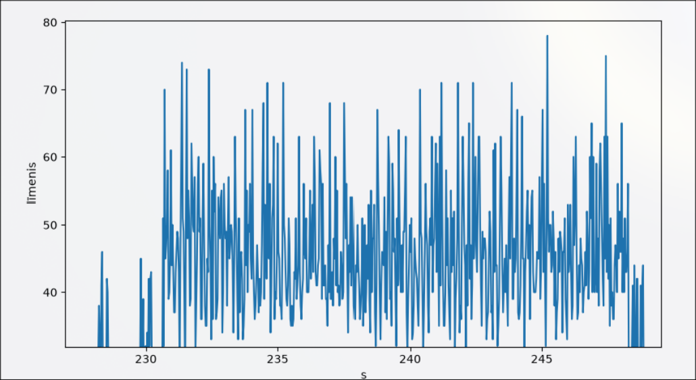

# HARDCore: bezvadu saite starp diviem Arduino ar divām stieplēm

Divi Arduino Uno sūta teksta ziņas viens otram **bez neviena vada starp platēm**.
Datus nes elektriskais lauks starp divām paralēlām stieplēm (kapacitīvā tuvlauka saite,
~0,5 pF). Multimetrs omu režīmā starp platēm rāda bezgalību.

<!-- Video: ievelc šeit GitHub tīmekļa redaktorā (mp4, < 10 MB) -->
<!-- Īss klips: poga → TX LCD → RX LCD "OK", multimetrs rāda ∞ -->

| | |
|---|---|
| Nesējfrekvence | 3205 Hz (`tone(3170)` uz Timer2 reāli dod 3205,13 Hz) |
| Ātrums | 50 ms/bits, ~11,7 s uz 4 burtu vārdu (ar 3 atkārtojumiem) |
| Attālums | ~6,5 cm starp stieplēm, 25 cm paralēlais posms |
| Uztvērējs | sinhronā I/Q detekcija, 24 paraugi uz tona periodu |

## Kā tas strādā

TX ieslēdz un izslēdz 3205 Hz toni uz D8 (ieslēgts = 1, izslēgts = 0). Caur 4,7 kΩ tonis
nonāk TX stieplē. RX stieple atrodas paralēli tai, un abas kopā veido niecīgu kondensatoru
C_m. RX pusē tam pretī ir ievada kapacitāte C_in ≈ 15 pF un 2 MΩ pull-down:



*Raw dati* no [data/rx_cal.csv](data/rx_cal.csv), vizualizēts ar [tools/plot.py](tools/plot.py)

τ = R·C ≈ 30 µs ir daudz īsāks par tona periodu (312 µs), tāpēc RX redz nevis taisnstūri,
bet **īsas smailes katrā frontē** (~5 V · C_m/C_in ≈ 35 ADC vienības).


*Vienkāršota shēma: ko ar ko savieno un kur atrodas elektrodi.*

## Aparatūra

| Daļa | Skaits | Kur |
|---|---|---|
| Arduino Uno R3 | 2 | TX, RX |
| LCD 16×2, 16 pinu (HD44780) | 1 | TX |
| Potenciometrs B5K | 1 | TX LCD kontrasts |
| 220 Ω | 1 | TX LCD fona gaisma |
| Pogas modulis (3 kājas) | 1 | TX D2 |
| LCD 16×2 ar I2C moduli | 1 | RX (0x27 vai 0x3F) |
| 4,7 kΩ | 2 | virknē ar abām stieplēm |
| 1 MΩ | 2 | virknē, A0 → GND (2 MΩ) |
| Stieple, 20–50 cm | 2 (+2 zemes pārim) | elektrodi |
| 9 V vai 6×AA | 2 | barošana uz VIN |


*Reālais saslēgums: katrs vads tieši tā, kā tas iet uz plates un maizes dēļa. Krustojumi bez punkta nav savienoti.*

**TX LCD:** RS→D12, E→D11, D4→D5, D5→D4, D6→D3, D7→D7, RW un K→GND, A caur 220 Ω→5V,
V0→potenciometra vidējā kāja.
**RX LCD:** SDA→SDA (A4), SCL→SCL (A5), VCC→5V, GND→GND.

## Protokols

Vienvirziena: RX nekad neraida, tāpēc nav apstiprinājumu. Drošumu nodrošina atkārtojumi
un kontrolsumma.

```
kadrs:  [start=1][seq][D6..D0][paritāte]   10 biti × 50 ms, tad 150 ms klusuma
vārds:  burts₁ … burtsₙ, EOT (0x04), summa (Σ & 0x7F)
```

- **seq** (augstākais bits) mainās katrā kadrā, un RX atmet atkārtotās kopijas;
- katru kadru sūta **3 reizes**;
- **pāra paritāte** katram kadram, **kontrolsumma** vārda beigās → RX rāda `OK` / `KLUDA` / `NEPILNS`;
- **sinhronizācija:** RX pieņem starta bitu tikai pēc ≥120 ms klusuma, tāpēc tas nevar
  iekrist kadra vidū un iestrēgt nobīdītā ritmā.

## Uztvērējs

`lib/saite/saite.h`, ar `-D SAITE_IQ`:

1. ADC brīvajā režīmā ar dalītāju 16 dod 16 MHz/16/13 = **76 923 paraugi/s = tieši 24 uz tona periodu**;
2. katrs paraugs × sin un × cos (24 elementu tabula), summa 5 ms blokā (16 periodi);
3. amplitūda ≈ max(|I|,|Q|) + ⅜·min(|I|,|Q|);
4. **bitu slieksnis** = vidus starp starta bita līmeni un fonu (katram kadram no jauna);
5. **starta slieksnis** = fons + 6 × fona svārstības (mācās darbības laikā).

**Mācība:** pirmā versija ņēma tikai 4 paraugus periodā. Smailēm (atšķirībā no sinusa) tad
rezultāts svārstījās 5× atkarībā no fāzes. RX noķēra startu "laimīgā" fāzē, uzlika augstu
slieksni, un visi datu biti nonāca zem tā: 100 % starti, 0 % vieninieki.

## Projekta struktūra

```
HARDCore/
├── platformio.ini
├── src/
│   ├── transmitter.cpp     TX: poga, seriālā konsole, 16 pinu LCD
│   └── reciever.cpp        RX: MODE 0–3, I2C LCD
├── lib/saite/saite.h       kopīgais protokols un uztvērējs
├── tools/
│   ├── txmon.py            TX↔RX salīdzināšana pa bitiem, statistika
│   ├── linkdiag.py         50 logi kadrā: nobīdes, loga un sliekšņa meklēšana
│   ├── viz.py              apstrādes vizualizācija (īsti dati vai simulācija)
│   ├── logger.py, live.py, plot.py, fold.py
├── wokwi/                  tx/, rx/, abi/ simulācijas diagrammas
├── data/                   mērījumi (.csv, .jsonl)
└── docs/                   shēmas, attēli
```

## Palaišana

```ini
[env]
platform = atmelavr
board = uno
framework = arduino
monitor_speed = 9600

[env:tx]
build_src_filter = +<transmitter.cpp>
lib_deps = arduino-libraries/LiquidCrystal

[env:rx]
build_src_filter = +<reciever.cpp>
lib_deps = marcoschwartz/LiquidCrystal_I2C
build_flags = -D SAITE_IQ
```

```bash
pio run -e tx -t upload
pio run -e rx -t upload
```

**RX režīmi** (`reciever.cpp`, `MODE`):

| MODE | Ko dara | Bodi | Rīks |
|---|---|---|---|
| 0 | darbs: vārdi, `OK`/`KLUDA`, `@B` kadri, LCD `S..F..` | 9600 | `txmon.py` |
| 1 | kalibrēšana: `Tagad` / `Max2s` | 9600 | `pio device monitor`, `live.py` |
| 2 | 50 logi pa 10 ms katram kadram | 115200 | `linkdiag.py` |
| 3 | neapstrādāti ADC paraugi un I/Q | 115200 | `viz.py` |

**TX:** poga = nejaušs 4 burtu vārds. Pogu turot, pieslēdzot barošanu, TX sāk bāku `0x55`.
Seriālā konsole: `VĀRDS`, `!b [HH]` bāka, `!t` nepārtraukts tonis, `!r N` atkārtojumi, `?`.

## Diagnostikas rīki

```bash
python3 tools/txmon.py --tx $TX --rx $RX --auto 20 -q      # TX↔RX pa bitiem
python3 tools/linkdiag.py --rx $RX --expect 55 --n 150     # RX MODE=2
python3 tools/viz.py --rx $RX --tx $TX --byte 4B           # RX MODE=3
python3 tools/viz.py --sim --dist 30 --noise 4             # bez platēm
```

`txmon.py` kopsavilkums: saņemto kopiju %, apgriezto bitu sadalījums, 1→0 pret 0→1
(slieksnis par augstu vai par zemu), RX līmeņu mediānas un signāls/fons.